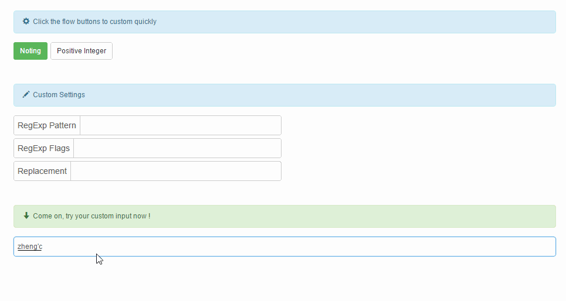

# vue-pattern-input

A Vue2.0 Component used RegExp to limit the user's input.

Works like native input element, you can add `maxlength` `class` attributes. You can use `v-model` too.

## Table of contents

- [Live Demo](#live-demo)
- [What's included](#whats-included)
- [Parameter declaration](#parameter-declaration)
- [Parameter declaration](#parameter-declaration)
- [Quick start](#quick-start)
- [Bugs and feature requests](#bugs-and-feature-requests)
- [Thought](#thought)
- [License](#license)

## Live demo

Just click there: [Live Demo](http://htmlpreview.github.io/?https://github.com/RoamIn/vue-pattern-input/blob/master/view/demo.html).



## What's included

Within the download you'll find the following directories and files, logically grouping common assets and providing both compiled and minified variations. You'll see something like this:

```
vue-pattern-input/
├── ...
├── src/
│   └── /component
│       └── pattern-input.vue // core
└── /view
    └── demo.html
```

## Parameter declaration


Parameter|Type|Default|Required|Description
--- | --- | --- | --- | --- |
regExp | RegExp | null | false | Using for: String.prototype.replace(regexp, replacement)
replacement | String | '' | false | Using for: String.prototype.replace(regexp, replacement)
v-model[.number] | String/Number | | true | Using for getting input value

## Commonly used regExp 

regExp|Description
--- | --- |
/^[0\D]\*\|\D*/g | positive integer
/[^a-z]/g | lowercase
/[^A-Z]/g | uppercase
/[^\w]/g | \w, Equivalent to [A-Za-z0-9_]
/[^\u4e00-\u9fa5]/g | Chinese


## Quick start

#### JavaScript

```javascript
setting: {
  regExp: /^[0\D]*|\D*/g, // Match any character that doesn't belong to the positive integer
  replacement: '',
  val: '223'
}
```

#### HTML

```html
<pattern-input class="your-class-name"
               :regExp="setting.regExp"
               :replacement="setting.replacement"
               @input="handleInput"
               @change="handleChange"
               v-model.number="setting.val"></pattern-input>
```

> This setting will make user input positive integer only.

> When you want get a Number, remember use `v-model.number`, and the safe maxlength is 15.

## Bugs and feature requests

Have a bug or a feature request? If your problem or idea is not addressed yet, [please open a new issue](https://github.com/RoamIn/vue-pattern-input/issues/new).

## Thought

I'm not sure is it necessary to emit all the input events. Now I only emit `input` and `change` events.

And I think the RegExp settings is not good enough, it's a bit awkward. Maybe I should match what I want instead of replacing what I don't want. But how ?

When I want to limit number range, it not convenient. In this condition, maybe create a [number-input](https://github.com/RoamIn/vue-custom-input) will be a good solution.


## License

Code released under the [MIT License](https://github.com/RoamIn/vue-pattern-input/blob/master/LICENSE).
